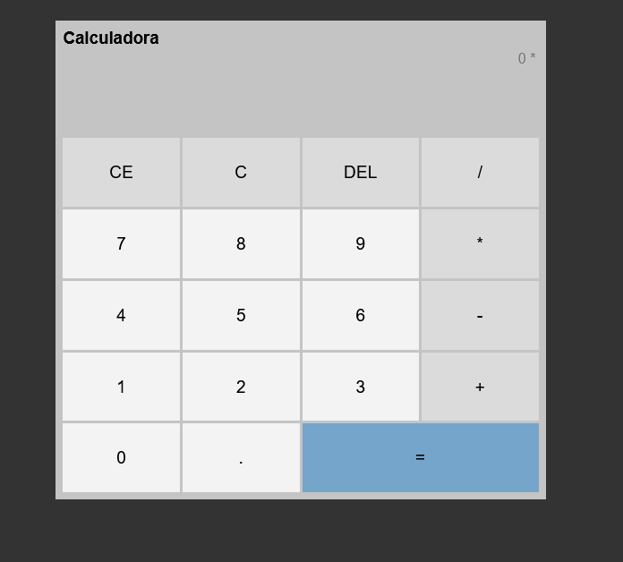

# Calculadora

1. Teste:
- Soma-se o número 2 com o 3, Resultado = 5

2. Teste:
- Soma-se 2 com 355, DEL deleta cada número por vez, já o CE apaga todo o número 355.

3. Teste:
- subtrai 3 - 2.

4. Teste:
- Resultado = 1.

5. Teste:
- Multiplica-se 2 * 0.

6. Teste:
- Resultado = 0.

7. Teste:
- Divide-se 9/3.

8. Teste:
- Resultado = 3.
